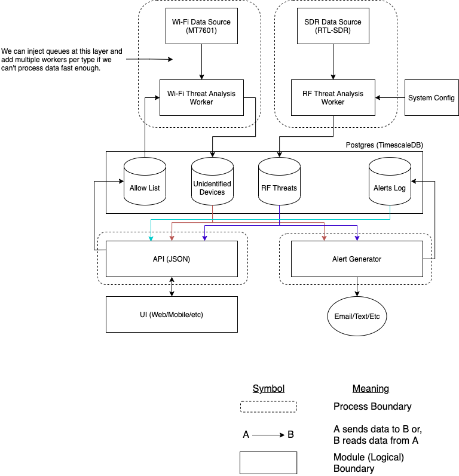

# System Architecture

The proposed architecture for the system is diagrammed below. At the bottom of the diagram there
is a legend indicating the different symbols in the diagram. One thing to take note of is the
distinction between a module boundary and a process boundary. The module boundary indicates a
logical unit of work that should be run by an isolated unit of logic. The diagram does not
communicate whether this is implemented as a separate class, python module, etc. The process boundary
indicates how the different modules could run to create the system. In the prototype, we expect
the data stream and the threat analysis logic to operate in one process while the data to surface
and take action on threats are separate, unified by the data storage layer.

