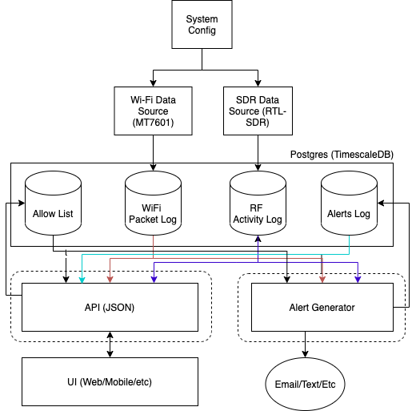

# System Architecture

The architecture for the system is diagrammed below. Each rectangle is presumed to be a separate process and should be written, so they can be run
independently and require an IPC mechanism. As most processes are talking to
a database, the database acts as the component for sharing data between processes.

